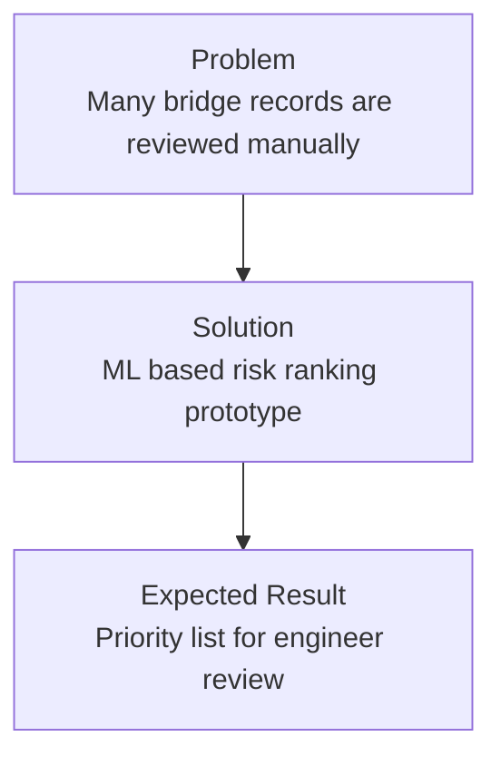
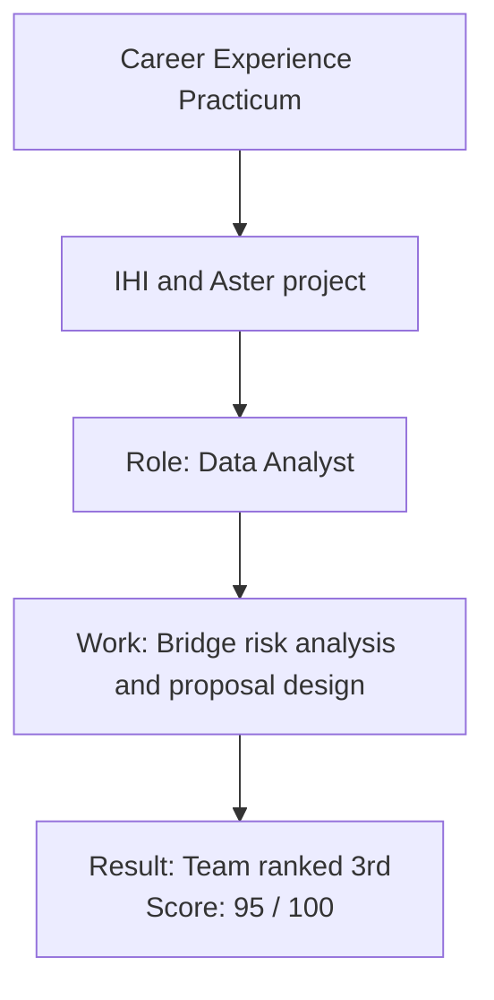
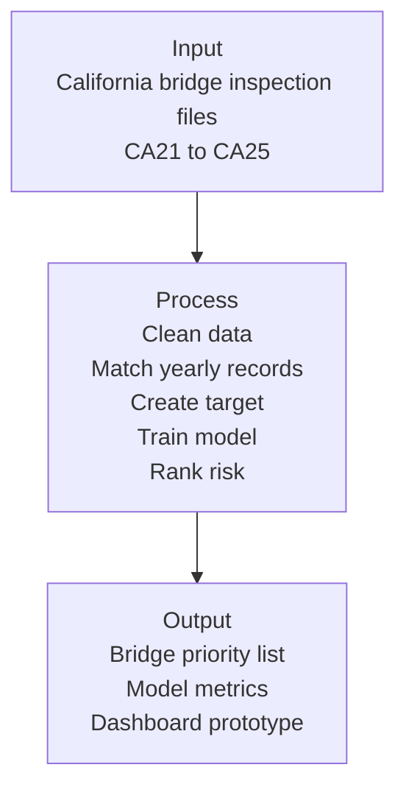
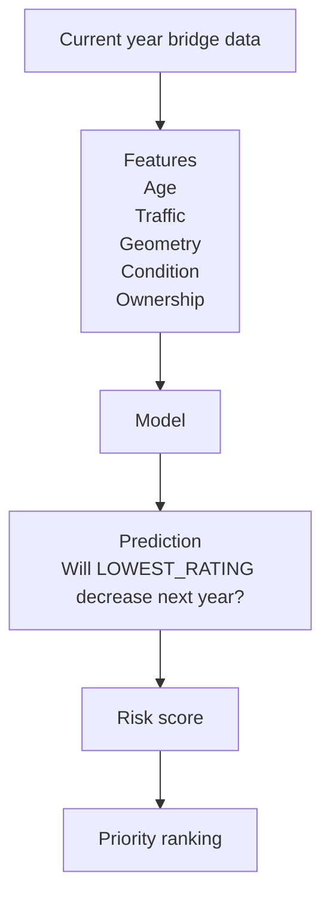
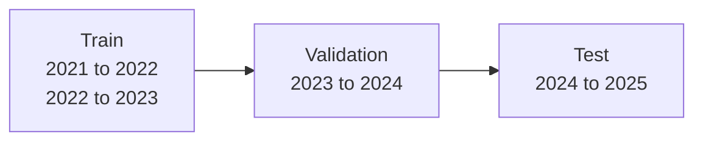
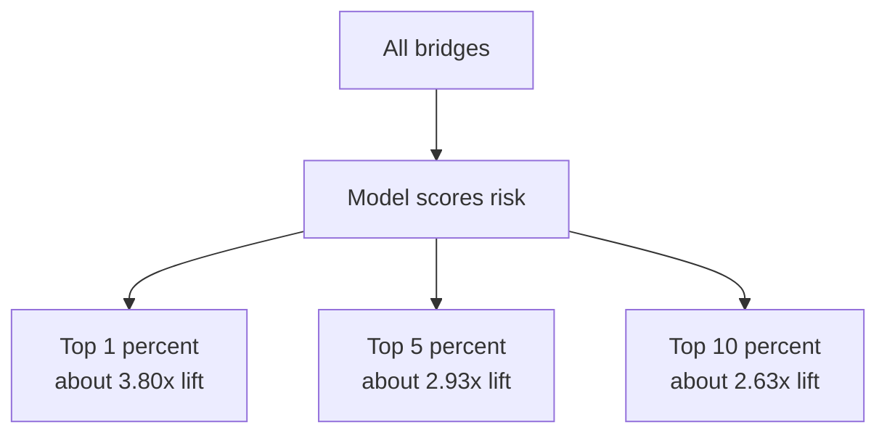
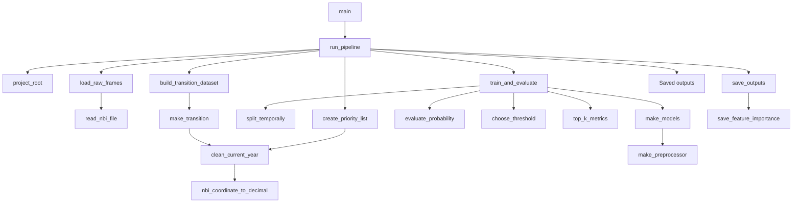
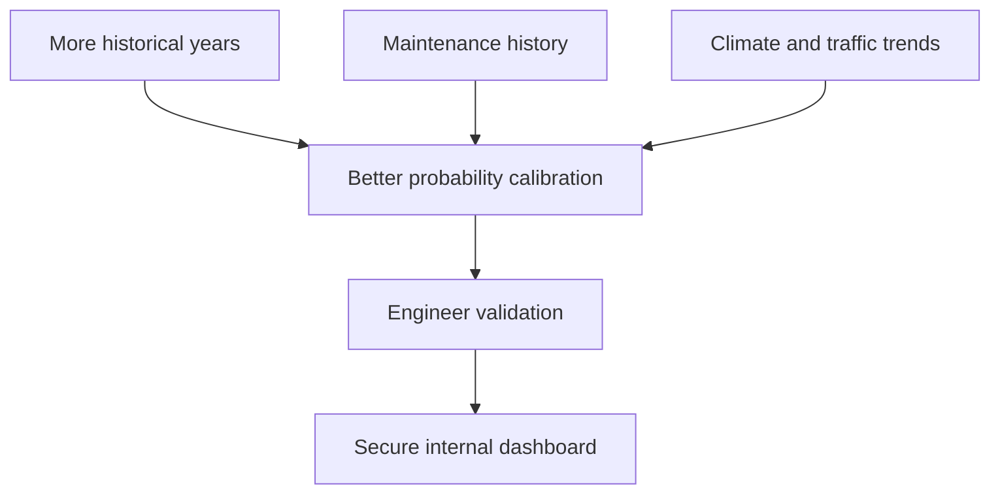

# Bridge Risk Intelligence Prototype

Machine learning prototype for **bridge deterioration risk prioritization**, developed from a Career Experience Practicum project with **IHI**.

The goal is to help analysts and engineers screen bridge inspection records faster and create a **priority list for review**.


---

## Project Overview



---

## Practicum Context



---

## Input and Output



---

## Machine Learning Task



---

## Validation Design



A temporal split is used because the model should be tested on future bridge records, not randomly mixed data.

---

## Models

| Model | Purpose |
|---|---|
| Logistic Regression | Simple baseline and explainable ranking |
| Decision Tree | Lightweight nonlinear comparison |

The best model is selected using **validation PR AUC**, because bridge deterioration is a rare event.

---

## Current Result

Selected model:

```text
Logistic Regression
```

| Metric | Value |
|---|---:|
| ROC AUC | 0.7197 |
| PR AUC | 0.0879 |
| Precision | 0.0900 |
| Recall | 0.3586 |
| F1 | 0.1438 |

Interpretation: the model has useful ranking signal, but it is not strong enough for engineering decisions alone.

---

## Ranking Value



This means the model can help reviewers start from a smaller, higher-risk group.

---

## Project Structure

```text
.
├── app.py
├── requirements.txt
├── notebooks/
│   └── 01_bridge_risk_prototype.ipynb
├── src/
│   └── bridge_risk_pipeline.py
├── data/
│   ├── raw/
│   └── processed/
├── outputs/
├── reports/
├── models/
└── docs/
```

---

## How to Run

```bash
python -m venv .venv
source .venv/Scripts/activate
pip install -r requirements.txt
python src/bridge_risk_pipeline.py --fast
streamlit run app.py
```

---

## Main Files

| File | Purpose |
|---|---|
| `notebooks/01_bridge_risk_prototype.ipynb` | Presentation notebook |
| `src/bridge_risk_pipeline.py` | Main data and ML pipeline |
| `app.py` | Streamlit dashboard prototype |
| `outputs/` | Priority list outputs |
| `reports/` | Metrics and analysis reports |
| `models/` | Saved trained model |

---
---
### Source code:
## Function Flow Diagram




---

## Limitation

This prototype predicts possible changes in reported bridge condition ratings.  
It does **not** predict bridge collapse, certify safety, or replace professional inspection.

---

## Future Work


